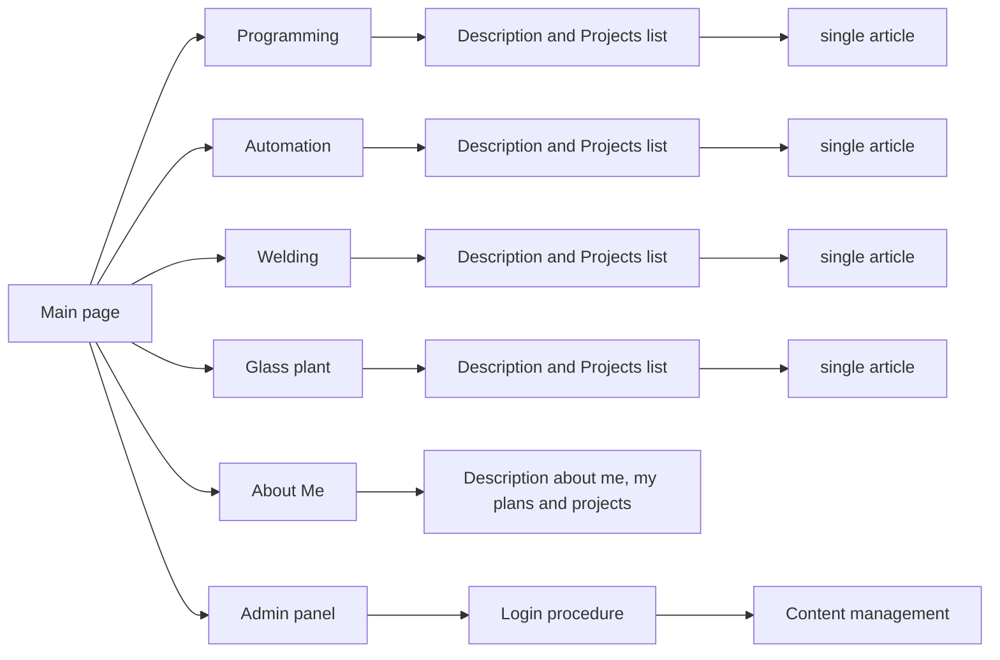

# Welcome to my visit card service
## Purpose 
	

This app was written because I want to show some information about me     and my projects. 	Information’s posted by this service are aimed at       recruiters and other people who are interested in technologies witch I use and want to learn. 

## Page map

## Languages

At this moment service is available only in my native language: Polish
Ultimately site will be Polish/English.

## Technology stack 

This application was made in React with TypeScript. Global store is operated by Redux and Redux - toolkit.
Rest of technologies:
	-  React Router
	- Sass preprocessor
	- js file downloader

## App description
Application was made for sharing information about my hobbies, work, industry experience. Service has admin panel with content management ability. After login procedure admin has the possibility to add new project articles with photos, edit and remove. Also there is an option to download a uploaded photography.  All added articles are visible for visitors in thematical tabs. Also last two added projects are visible on main page. In ,, about me " tab there is some information about my personality, and who am I.  I cordially invite you to read information’s included here. 

## Back-end part
Backend is inseparable part of this app. You can find them in my repository https://github.com/darone90/card_back

## React app develop and production start

To start app after cloning this repository you need to install node module packages. Also node package manager is required. To install packages use console and tap:

- npm install

After that to start development server use command: 
- npm start

To build static production version:
- npm run build 

## Copyrights

All code located in this repository is free to use for everyone.

## Contact

If you want to reach me you can use email: pielckidariusz90@gmail.com
